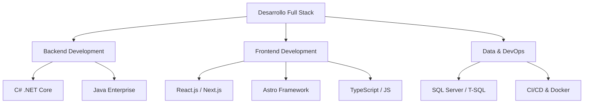

# Cristian Añazco Martínez

  <strong>Desarrollador Full Stack | Especialista en C# (.NET Core), React & Astro</strong>

  
  
  

---

### 👤 Perfil Profesional

Desarrollador de Software orientado a resultados y especializado en el desarrollo Full Stack. Con experiencia en la arquitectura e implementación de sistemas empresariales de alta eficiencia y automatización de procesos. Mi enfoque combina la robustez y escalabilidad en backend con **C# (.NET Core)** y **Java**, junto con la creación de interfaces de usuario modernas, veloces y de alta performance mediante **React**, **Astro** y **TypeScript**.

*   **Enfoque de Desarrollo:** Clean Code, patrones de diseño de software y optimización del rendimiento tanto en cliente como en servidor.
*   **Bases de Datos:** Sólida experiencia en el diseño y optimización de esquemas de datos relacionales con **SQL Server (T-SQL)** y **PostgreSQL**.

---

### ⚙️ Áreas de Especialización

---

### 🛠️ Stack Tecnológico

<table width="100%">
  <tr>
    <td width="50%" valign="top">
      <h4>🖥️ Frontend & Diseño</h4>
      <ul>
        <li><strong>Lenguajes:</strong> TypeScript, JavaScript (ES6+), HTML5, CSS3</li>
        <li><strong>Frameworks:</strong> React.js, Astro</li>
        <li><strong>Estilos:</strong> TailwindCSS, Sass, CSS Modules</li>
      </ul>
    </td>
    <td width="50%" valign="top">
      <h4>⚙️ Backend & API</h4>
      <ul>
        <li><strong>Lenguajes:</strong> C# (.NET Core), Java SE/EE, Python</li>
        <li><strong>Entornos & Server:</strong> Node.js, ASP.NET Web API</li>
        <li><strong>Patrones:</strong> MVC, Arquitectura Limpia, RESTful APIs</li>
      </ul>
    </td>
  </tr>
  <tr>
    <td width="50%" valign="top">
      <h4>💾 Bases de Datos</h4>
      <ul>
        <li><strong>Relacionales:</strong> Microsoft SQL Server (T-SQL), PostgreSQL</li>
        <li><strong>ORM/Herramientas:</strong> Entity Framework Core, JDBC</li>
      </ul>
    </td>
    <td width="50%" valign="top">
      <h4>🔧 Herramientas & DevOps</h4>
      <ul>
        <li><strong>Control de Versiones:</strong> Git, GitHub</li>
        <li><strong>Contenedores & CI/CD:</strong> Docker, GitHub Actions</li>
        <li><strong>Entornos de Dev:</strong> VS Code, Visual Studio, IntelliJ IDEA</li>
      </ul>
    </td>
  </tr>
</table>

---

### 📂 Proyectos Destacados

<table width="100%">
  <tr>
    <td width="50%" valign="top">
      <h4>🏢 GENSYS</h4>
      
<em>Ecosistema de Automatización y Generación Web</em>

      
Plataforma empresarial diseñada para automatizar flujos de trabajo y generación de código de alto rendimiento, optimizando tiempos de desarrollo.

      

        
        
        
        
      

    </td>
    <td width="50%" valign="top">
      <h4>⛪ SIGASC</h4>
      
<em>Sistema de Gestión de Actas Sacramentales</em>

      
Solución informática dedicada a la digitalización, control y administración de registros sacramentales, asegurando la consistencia y seguridad de la información.

      

        
        
        
      

    </td>
  </tr>
  <tr>
    <td width="50%" valign="top">
      <h4>📜 GestCon_Anhazco</h4>
      
<em>Sistema de Gestión de Convenios</em>

      
Aplicación empresarial desarrollada para centralizar, controlar y auditar convenios interinstitucionales entre universidades y entidades públicas/privadas.

      

        
        
      

    </td>
    <td width="50%" valign="top">
      <h4>👁️ Visionary</h4>
      
<em>Plataforma Interactiva & Optimización Frontend</em>

      
Módulo interactivo del lado del cliente orientado al renderizado rápido de interfaces dinámicas y optimización de recursos.

      

        
        
        
      

    </td>
  </tr>
</table>

---

### 📊 Estadísticas Profesionales

  
  

---

  "La simplicidad es la máxima sofisticación." — Leonardo da Vinci

